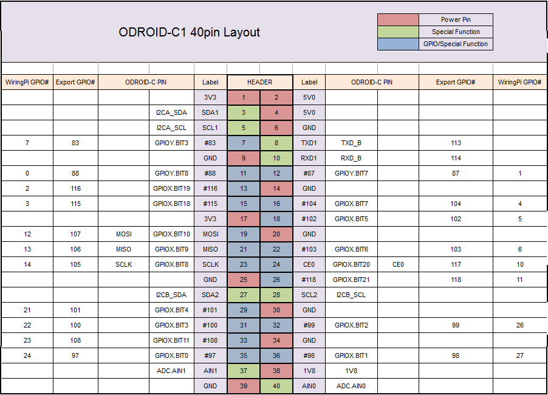

---
title: GPIO
layout: template
filename: gpio
--- 

## Using GPIO Pins on the ODROID



### CLI

```bash
echo ${PIN} > /sys/class/gpio/export # PIN = whichever GPIO pin you decided to use
echo ${MODE} > /sys/class/gpio/gpio${PIN}/direction # MODE = 'in' or 'out'  
echo ${VALUE} > /sys/class/gpio/gpio${PIN}/value # VALUE = 1 for HIGH and 0 for LOW
echo ${PIN} > /sys/class/gpio/unexport # Done with using PIN
```

###  C/C++

See [This Github Repo](https://github.com/olinrobotics/Odroid_Setup/tree/master/gpio) for Basic C++ interface with GPIO.

For more sophisticated applications, see [This Github Repo](https://github.com/hardkernel/wiringPi).

Currently, software PWM on wiringPi doesn't work on the ODROID C1/C1+.


